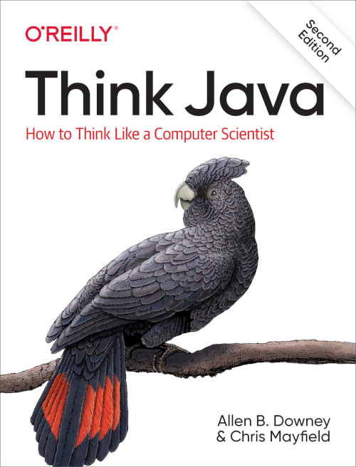

# Literatuur

Het begeleidend boek *Think Java: How to Think Like a Computer Scientist*{cite}`Downey_Allen_B_2019-12-24`. Een PDF versie van dit boek is te vinden op [https://greenteapress.com/wp/think-java-2e/](https://greenteapress.com/wp/think-java-2e/).  Wij verwijzen hier en daar ook naar de [online versie](https://books.trinket.io/thinkjava2/) van dit boek op [Trinket](https://trinket.io/). Dit is een *interactieve* versie waar je tegelijkertijd code fragmenten kan schrijven en uitvoeren.



Als je een student aan de Hanzehogeschool bent is het zeer waarschijnlijk dat je Python als eerste taal hebt geleerd. Je zult veel overeenkomsten met Java zien, maar ook voldoende verschillen! Om deze reden verwijzen we ook soms naar [Java for Python Programmers](https://runestone.academy/runestone/books/published/java4python/index.html) waar de twee talen naast elkaar worden gezet. Dit materiaal is ter ondersteuning en kan jou helpen sneller bepaalde syntax en concepten te begrijpen.

<!--

-->

```{bibliography}
```